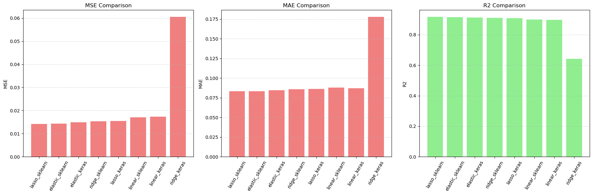

# Regression Models Comparison

This project provides a **comprehensive benchmark** of regression algorithms—implemented in both **analytical closed-form solutions** and **numerical gradient descent optimization**—on the **House Prices: Advanced Regression Techniques** dataset. It includes robust preprocessing, categorical encoding strategies, model training, and detailed performance evaluations.

---

## Results & Interpretation

* **Ridge Regression**: Reduces variance and mitigates overfitting  
* **Lasso Regression**: Enforces sparsity, enabling feature selection  
* **Elastic Net**: Combines benefits of Ridge and Lasso → High performance  
* **Analytical vs Numerical**:  
  * Analytical: Faster on small to moderate datasets  
  * Numerical: Scalable for high-dimensional, large datasets  

| Model                          | R² Score     | MAE    | RMSE    | Kaggle Score | Overfitting | Notes |
|--------------------------------|-------------|--------|---------|--------------|-------------|-------|
| **Linear Regression (scikit-learn)** | 0.87–0.89   | ~0.19  | 0.25691 | **0.25691**  | Slight      | Stable baseline; captures linear trends well |
| **Linear Regression (Keras)**        | ~0.63       | ~0.28  | 0.33366 | **0.33366**  | Severe      | Underfitting; poor convergence due to LR/epochs |
| **Ridge Regression (scikit-learn)**  | ~0.85       | ~0.20  | 0.17050 | **0.17050**  | Minimal     | L2 helps stability; modest improvement |
| **Ridge Regression (Keras)**         | ~0.63       | ~0.27  | 0.24580 | **0.24580**  | Underfitting | Optimization issues; needs tuning |
| **Lasso Regression (scikit-learn)**  | ~0.89       | ~0.17  | 0.13459 | **0.13459**  | Low         | Strong feature selection; excellent generalization |
| **Lasso Regression (Keras)**         | ~0.89       | ~0.17  | 0.15724 | **0.15724**  | Low         | Better than other Keras models; slight tuning gap |
| **ElasticNet (scikit-learn)**        | ~0.89       | ~0.17  | 0.13396 | **0.13396**  | Very low    | Best balance of L1 + L2; top performer |
| **ElasticNet (Keras)**               | ~0.89       | ~0.17  | 0.14579 | **0.14579**  | Low         | Solid, but suboptimal training vs. scikit-learn |


### Visualization (Optional)
Plots can be generated to visualize:
* R² scores comparison across models  
* Coefficient shrinkage effects in Lasso and Elastic Net  
* Loss curves during numerical optimization  



---

## 1. Overview

This repository demonstrates:

* End-to-end pipeline for handling mixed-type housing data
* Comparison of **four regression algorithms**:
  1. **Linear Regression**
  2. **Ridge Regression** (L2 regularization)
  3. **Lasso Regression** (L1 regularization)
  4. **Elastic Net** (combined L1 and L2 regularization)
* **Dual implementations**:
  * **Analytical (Closed-form)**: Using Scikit-learn
  * **Numerical (Gradient Descent)**: Using TensorFlow/Keras
* Evaluation via statistical metrics and learned model parameters

---

## 2. Project Structure

```

project\_root/
│── data/
│   └── test.csv
│   └── train.csv
│── notebooks/
│   └── 01\_eda.ipynb
│   └── 02\_regression.ipynb
│── requirements.txt
│── READMEd.m                   # Project documentation

````

---

## 3. Dataset

* **Source**: [House Prices: Advanced Regression Techniques - Kaggle](https://www.kaggle.com/competitions/house-prices-advanced-regression-techniques)
* **Target variable**: `SalePrice`
* **Feature types**:
  * **Nominal categorical**: Zone, Street type, Neighborhood, etc.
  * **Ordinal categorical**: Quality ratings, Condition scales
  * **Numerical**: Lot size, living area, garage size, etc.

---

## 4. Data Preprocessing

### 4.1 Feature Classification
* **Nominal**: Non-ordered categories → One-hot encoded  
* **Ordinal**: Ordered categories → Integer-mapped  
* **Continuous/Discrete numeric**: Used directly  

### 4.2 Encoding
* **One-hot encoding** for nominal categorical variables  
* **Ordinal mapping** with semantic integer scoring  

### 4.3 Scaling
* Standardization with `StandardScaler` to ensure stable training  

---

## 5. Regression Models

Each regression algorithm is implemented in **two approaches**:

### 5.1 Linear Regression
* **Analytical**: `LinearRegression`  
* **Numerical**: Keras dense layer, optimized with Adam + MSE  

### 5.2 Ridge Regression
* **Analytical**: `Ridge` with L2 penalty  
* **Numerical**: Keras dense layer with `l2` regularizer  

### 5.3 Lasso Regression
* **Analytical**: `Lasso` with L1 penalty  
* **Numerical**: Keras dense layer with `l1` regularizer  

### 5.4 Elastic Net
* **Analytical**: `ElasticNet` with combined L1 and L2  
* **Numerical**: Keras dense layer with `l1_l2` regularizer  

---

## 6. Evaluation Metrics

* **R² Score**: Proportion of variance explained  
* **MAE**: Average prediction error  
* **Coefficients & Intercept**: Feature weight analysis  
* Side-by-side comparison between analytical and numerical solutions  

---

## 9. Installation

```bash
git clone https://github.com/honggquan24/regression_comparison
cd regression_comparison
pip install -r requirements.txt
````

Requirements:

* Python 3.8+
* NumPy, Pandas, Scikit-learn, TensorFlow, Matplotlib
